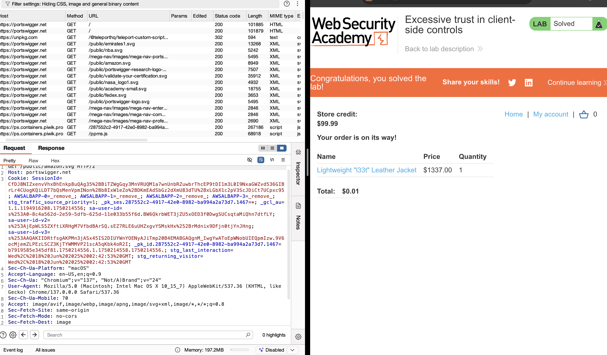

# Lab: Excessive Trust in Client-Side Controls (Price Manipulation)

## Lab Description
This lab involves a business logic vulnerability in a shopping application where the server trusts the **price parameter** submitted by the client. By modifying this parameter in an intercepted HTTP request, it’s possible to purchase an expensive item for a much lower price.

---

## Objective
- Intercept and manipulate the HTTP request responsible for adding items to the cart.
- Modify the `price` parameter to a minimal value.
- Successfully complete a purchase at a fraudulent price.

---

## Environment Setup
- Target URL:  
  `https://portswigger.net/web-security/logic-flaws/examples/lab-logic-flaws-excessive-trust-in-client-side-controls`
- Tools used:  
  - Burp Suite (Community Edition)  
  - Burp Proxy + Intercept  
  - Chromium-based browser launched from Burp

---

## Step-by-Step Exploit Walkthrough

### 1. Access the Lab Instance
- Open Burp and ensure **interception is OFF**.
- Use Burp's browser to visit the lab URL and click **Access the lab**.

### 2. Log In
- Navigate to **My account**.
- Log in with:
  - **Username:** `wiener`
  - **Password:** `peter`
- Note your store credit (e.g., $100).

### 3. View Product Details
- From the homepage, locate the **Lightweight "l33t" leather jacket** and click to view its details.

### 4. Intercept Add-to-Cart Request
- In Burp, go to **Proxy > Intercept** and turn interception **ON**.
- In the browser, click **Add to cart**.
- In Burp, locate the intercepted `POST /cart` request.

### 5. Modify the Price Parameter
- In the request body, find:
  
  text
  price=133700

* Change the value to:

  text
  price=1

* Click **Forward** and then **Forward all** to send the manipulated request.

### 6. Complete the Purchase

* Disable interception to resume normal traffic.
* Click the **basket icon** in the top-right corner.
* Verify the jacket is now in your cart for \$0.01.
* Click **Place order** to complete the purchase and solve the lab.

---

## HTTP Request Before and After

### Original Request:

http
POST /cart HTTP/1.1
Host: <lab-host>

productId=1&price=133700

### Modified Request:

http
POST /cart HTTP/1.1
Host: <lab-host>

productId=1&price=1

---

## Screenshots and Images

4. **Order Confirmation:**
   Screenshot of the success message after clicking "Place order."
   

---

## Lessons Learned

* Never trust **client-side parameters** like price, role, or discounts.
* Server-side validation is essential for enforcing business logic rules.
* Burp Suite allows for easy interception and manipulation of HTTP requests, making it a powerful tool for identifying logic flaws.

---

## Conclusion

This lab demonstrates how over-reliance on client input (such as trusting price fields) can be exploited to commit fraud. Using Burp Suite, we modified the `price` parameter in a `POST` request and successfully purchased an expensive item for a penny.

