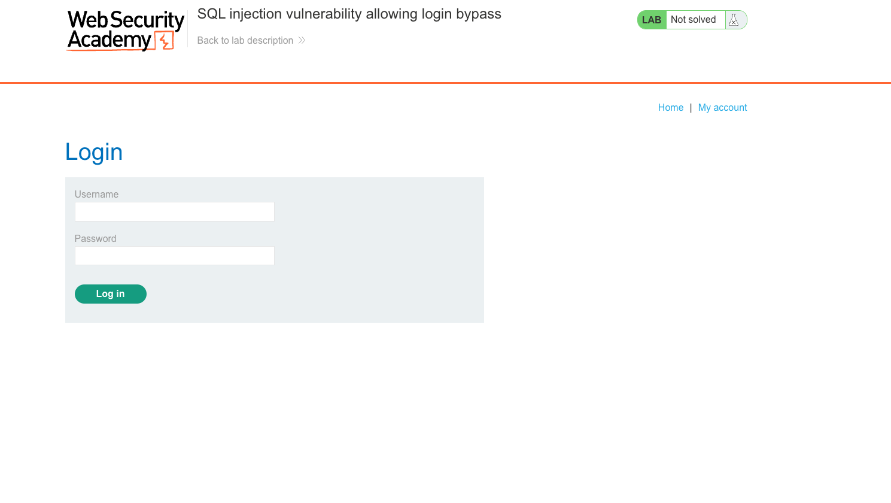
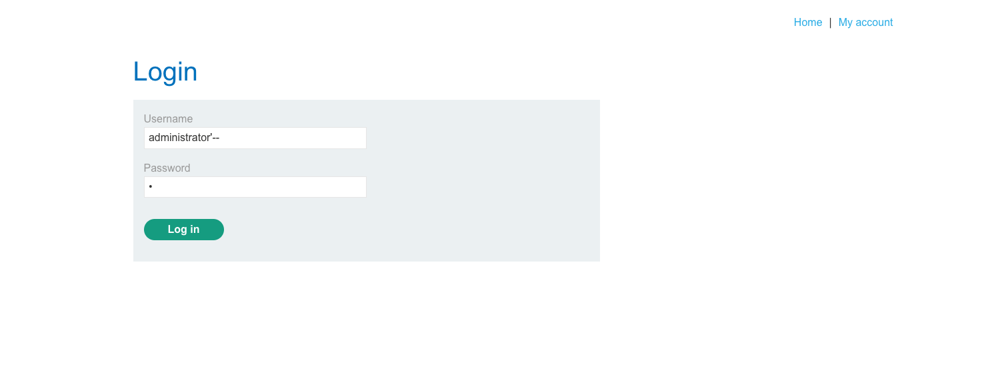
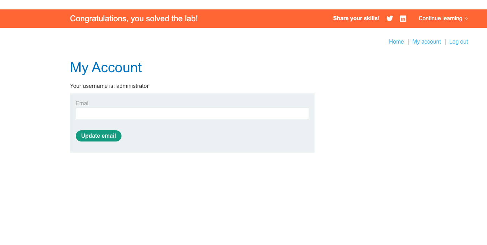

# Lab: SQL Injection Vulnerability Allowing Login Bypass

## Lab Description
This lab contains a SQL injection vulnerability in the login function. The objective is to perform a SQL injection attack that allows you to log in as the **administrator** user.

---

## Objective
- Exploit a SQL injection vulnerability in the login form.
- Successfully bypass authentication and log in as the `administrator`.

---

## Environment Setup
- Target URL: `https://<lab-url>/login`
- Tools used:
  - Browser (Chrome/Firefox)
  - Burp Suite (optional, for request inspection)

---

## Step-by-Step Exploit Walkthrough

### 1. Initial Recon
- Visited the login page and observed a standard username/password input form.
- Tried submitting default credentials (e.g., `admin` / `admin`) to understand error behavior.

### 2. Understanding the Likely Backend Query
Typical SQL login logic looks like:

```sql
SELECT * FROM users WHERE username = '<input-username>' AND password = '<input-password>';
````

This means:

* If we can manipulate the `username` input to always return true, we can bypass the password check.

---

### 3. Payload Testing and Injection

#### Attempted Inputs:

* `admin--`
* `admin --` *(space after comment, did not always work)*
* `administrator'--` *(successful)*

#### Final Working Input:

* **Username:** `administrator'--`
* **Password:** (any random character, e.g., `x`)

This transforms the query into something like:

```sql
SELECT * FROM users WHERE username = 'administrator'--' AND password = 'x';
```

The `--` comments out the rest of the query after the username, completely skipping the password condition.

---

### 4. Results and Verification

* The application logged in as `administrator`.
* Lab was successfully marked as solved after login.

---

## Payloads Used

| Field    | Payload             | Description                          |
| -------- | ------------------- | ------------------------------------ |
| Username | `administrator'--`  | Injected comment to bypass password  |
| Password | `x` (or any string) | Ignored due to SQL comment injection |

---

## Lessons Learned

* Login forms are common targets for SQL injection.
* A simple `'--` can bypass authentication when the server concatenates inputs directly into SQL.
* Always use **parameterized queries** or **prepared statements** to avoid this.

---

## Screenshots and Images

1. **Login Form (Before Injection):**
   Screenshot of the original login form before entering the injection payload.
   

2. **Payload Entered in Form:**
   Screenshot of the form with `administrator'--` in the username field and any character in the password.
   
3. **Successful Login:**
   Screenshot after being logged in as `administrator`. This confirms success.
   

---

## Conclusion

This lab demonstrates how login mechanisms can be bypassed using basic SQL injection techniques when user input is not properly sanitized or handled with secure coding practices.

