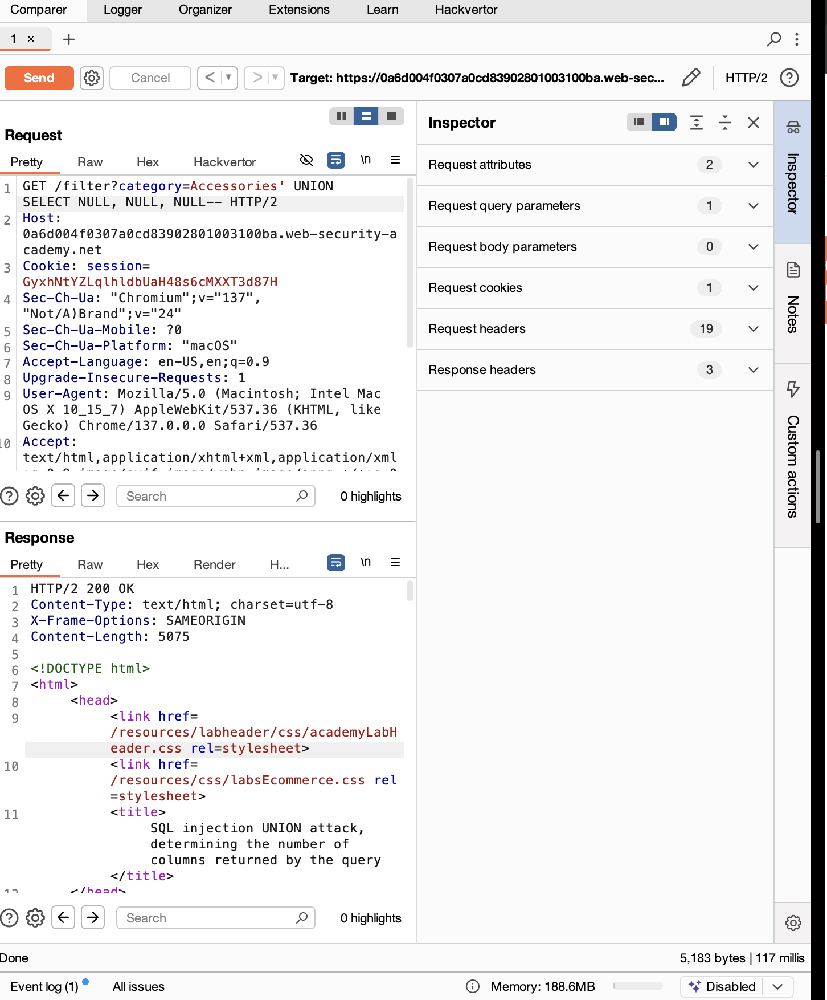

# Lab: SQL Injection UNION Attack - Determine Number of Columns

## Lab Description
This lab contains a SQL injection vulnerability in the product category filter. The application executes a SQL query that returns multiple columns, and you can use a UNION attack to inject additional queries. To perform a successful UNION injection, you first need to determine how many columns the original query returns.

The goal is to find the exact number of columns returned by the original query by injecting a UNION SELECT statement with `NULL` values and adjusting the number of `NULL`s until the page responds without an error.

---

## Objective

- Identify the number of columns returned by the original SQL query.
- Use `UNION SELECT NULL, NULL, ...` payloads with increasing numbers of `NULL`s.
- Find the column count that results in a valid response without SQL errors.

---

## Environment Setup

- Target URL: `https://<lab-url>/filter?category=...`
- Tools used:
  - Web browser (Chrome)
  - Burp Suite Repeater (for intercepting and modifying requests)

---

## Step-by-Step Exploit Walkthrough

### 1. Test Injection Point

- The `category` parameter appears vulnerable to SQL injection.
- Confirmed by injecting a single quote `'` and observing response behavior.

---

### 2. Inject UNION SELECT Payloads

- Start with one column:

```

category=Accessories' UNION SELECT NULL--

```

- If this causes an error, increment the number of `NULL`s:

```

category=Accessories' UNION SELECT NULL, NULL--

```

- Continue increasing the number of `NULL`s until the server responds normally.

---

### 3. Determine Column Count

- The payload that successfully returns a valid page with no SQL error determines the number of columns.
- For this lab, `3` was the correct number of columns:

```

category=Accessories' UNION SELECT NULL, NULL, NULL--

```

---

### 4. Verify Results

- The page loads successfully with the injected payload.
- No error messages appear.
- The lab is marked as solved.

---

## Payloads Used

| Number of Columns | Payload                              |
|-------------------|------------------------------------|
| 1                 | `Accessories' UNION SELECT NULL--` |
| 2                 | `Accessories' UNION SELECT NULL, NULL--` |
| 3 (correct)       | `Accessories' UNION SELECT NULL, NULL, NULL--` |

---

## Lessons Learned

- `UNION SELECT` injections require the injected query to have the **same number of columns** as the original.
- Incrementally testing with `NULL` values helps discover this number safely.
- This technique is foundational for further SQL injection exploitation, such as extracting data.

---

## Screenshots and Images

1. **Interception:**

 Screenshot of Burp Repeater showing the successful payload with 3 `NULL`s and the corresponding HTTP 200 OK response.
 


2. **Page Rendered:**

 Screenshot of the page after injection, confirming normal display without errors


---

## Conclusion

Determining the correct number of columns in a SQL query is a critical initial step for successful UNION-based SQL injection attacks. Using this technique prevents syntax errors and enables precise data extraction in subsequent steps.